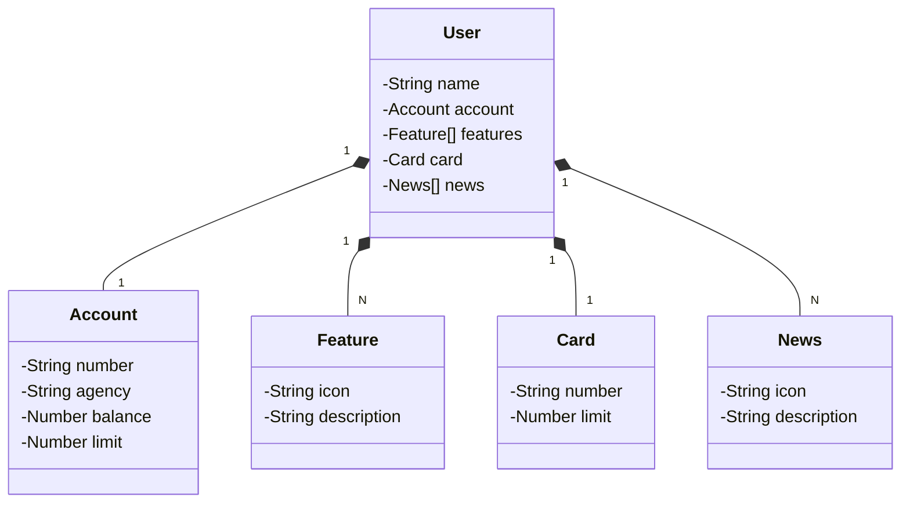

### Descrição 📃
Introdução a criação de uma API REST utilizando Spring JPA, Spring WEB, e OpenApi. 
API contectava com o serviço cloud da Railway que hospeda o banco de dados em postegre

### Estrutura do Projeto 🏗️
- src/: Código-fonte da aplicação
- build.gradle: Configurações do Gradle
- Procfile: Configuração para deploy no Railway

### Tecnologias Utilizadas ⚙️
- [x] Java
- [x] Spring JPA
- [x] Spring WEB
- [x] OpenApi
- [x] PostgreSQL
- [x] Railway

### Instalação 🔛
 - Clone o repositório: git clone https://github.com/murilosolino/api-rest-nuvem
- Navegue até o diretório do projeto: cd api-rest-nuvem
- Execute o projeto com o Gradle: ./gradlew bootRun
- Após isto acesse http://localhost:8080/swagger-ui/index.html#/
- 
## Diagrama de Classes (Domínio da API)

